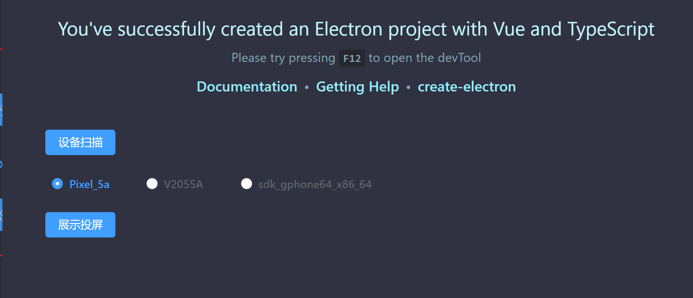

# AndroidDevHelper

## 项目简介

项目使用Electron+Vue3+TypeScript完成scrcpy命令行（投屏软件）的桌面端跨平台程序


## 运行项目

1、 克隆代码，到目录下执行 `npm install` 安装依赖

2、 找到package.json

```
    "dev": "electron-vite dev",
    "build": "npm run typecheck && electron-vite build",
    "postinstall": "electron-builder install-app-deps",
    "build:win": "npm run build && electron-builder --win --config",
    "build:mac": "npm run build && electron-builder --mac --config",
    "build:linux": "npm run build && electron-builder --linux --config"
```

3、 执行dev命令运行项目， build:xxx 在xxx平台打包


## 运行效果




## 项目技术栈

Electron桌面端程序开发框架

- 完善Electron Main、Render Process之间的进程间通信

TypeScript

- 强制规范代码风格

Vue3

- 采用element-ui组件简化开发


## 拓展思路

基于此模板开发更多具有某些便捷功能的跨平台程序， 如嵌入脚本到程序中、其他命令行集成……


## 参考文献

- https://developer.mozilla.org/zh-CN/docs/Learn/CSS/CSS_layout/Flexbox
- https://www.electronjs.org/zh/docs/latest/
- Electron IPC 机制 https://www.electronjs.org/zh/docs/latest/tutorial/ipc

- 《Electron&Vue&element-ui 's problems》https://www.yuque.com/jailedbird/ho06i8/gtsy0slw4debuqhe?singleDoc# 
- https://doc-archive.element-plus.org/#/zh-CN/component/layout
- create-electron 快速搭建一个完善的Electron项目 https://juejin.cn/post/7086245787855749133
